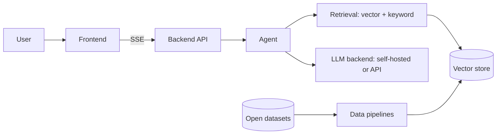

# scitech-rag-agent
An interactive web app where an AI agent answers science and technology questions using retrieval over a large-scale corpus, and suggests relevant follow-up questions.

> Status: course project (8 weeks). See [docs/04-roadmap.md](docs/04-roadmap.md) for the plan and [docs/00-project-brief.md](docs/00-project-brief.md) for scope.

## What it does
1. The user asks a question about a science or technology topic.
2. The agent rewrites and, if needed, decomposes the question, retrieves evidence from an indexed corpus, and answers **only from that evidence, with citations**. If evidence is insufficient it says so.
3. The app proposes follow-up questions based on the answer and the retrieved context.

## Architecture in one picture

Details: [docs/01-architecture.md](docs/01-architecture.md).

## Repository map
| Path | Purpose |
|---|---|
| `pipelines/` | Ingestion, cleaning, chunking, embedding |
| `agent/` | Agent loop, retrieval orchestration, prompts, follow-up suggestions |
| `backend/` | FastAPI service exposing the API contract |
| `frontend/` | User interface |
| `evaluation/` | Golden question set, metrics, experiment reports |
| `docs/` | Brief, architecture, contracts, decisions, task briefs, journals |
| `.github/` | Issue/PR templates, CI, CODEOWNERS |

## Quick start
```bash
cp .env.example .env        # fill in real values; never commit .env
make setup                  # dev tooling + backend dependencies
make up                     # start Qdrant via Docker
make run                    # backend at http://localhost:8000 (GET /health)
make lint test
```

## Working on this repo
Start with [AGENTS.md](AGENTS.md) (also the entry point for AI coding agents) and [CONTRIBUTING.md](CONTRIBUTING.md).
